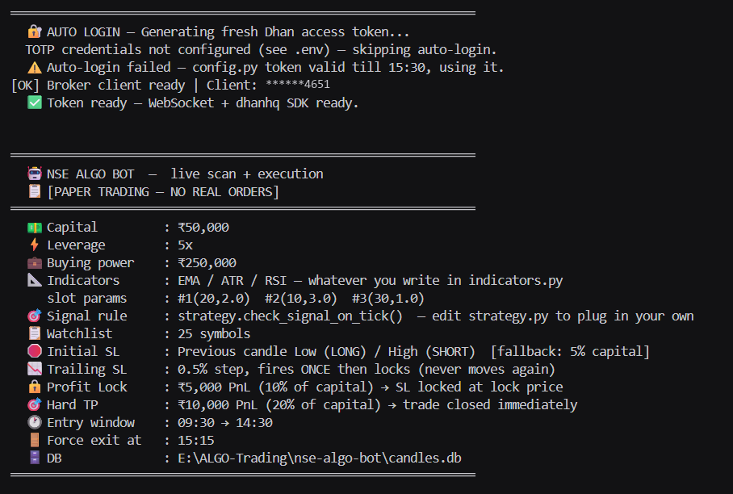
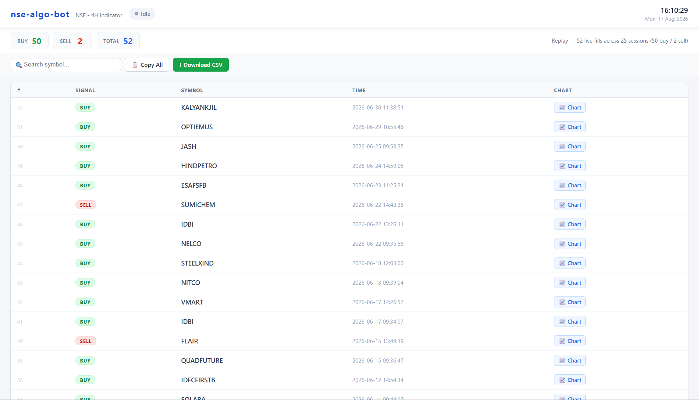

# NSE Algo Bot

**A complete intraday trading bot for NSE equities — everything except the trading rule.**

One command before the bell and it runs the whole day on its own: refresh the candle database, log in, warm up indicator state for the whole watchlist, connect the market feed, evaluate each tick, size the trade against real broker leverage, place the order, then manage the stop, the trail and the exit until the position is squared off.

<p align="left">
  
  
  
  
</p>

> [!IMPORTANT]
> **This repository ships no strategy — on purpose.** [`indicators.py`](indicators.py) and [`strategy.py`](strategy.py) are empty scaffolds: documented function signatures, every one of them `NotImplementedError`. No indicators, no thresholds, no entry rule. Everything *around* them is complete and is the point of this repository. Write those two files and the bot runs.

---

## Where your code goes

Two files, and nothing else needs touching.

**[`indicators.py`](indicators.py) — compute the numbers.** Six batch functions that run over a full DataFrame of completed candles, plus two that keep a small state dict moving forward one candle at a time. That split exists because a tick cannot afford to recompute history: the batch path runs once before the open, `extract_state()` folds it into a few values, and from then on each new candle only calls `increment_state()`.

> The contract that matters: walking a series with `increment_state()` must produce the same values as the batch functions over that same series. If they drift, the bot trades one thing and your backtest reports another.

**[`strategy.py`](strategy.py) — make the decision.** Two functions:

| Function | Called | Returns |
| :--- | :--- | :--- |
| `precompute_state(security_id, symbol)` | once per stock, before the open, in parallel | a cache dict — history loaded, indicators run |
| `check_signal_on_tick(cached, ltp, today_ohlc, ...)` | every tick, for every stock | `("LONG" \| "SHORT" \| None, state)` |

Whatever you put in `state` is printed when a signal fires and pushed to the dashboard, so put your condition flags there — that is what makes a fill explainable three weeks later. Both files carry a complete worked example in their header comments.

---

## What you get around it

```
  ┌──────────────────────────────────────────────────────────────────┐
  │  BEFORE THE BELL                                                 │
  │    watchlist   symbols → security IDs from the instrument master │
  │    db          1H candles → aggregated to 4H, incrementally      │
  │    auto_login  fresh token over TOTP, verified against the API   │
  │    warm-up     indicator state per stock, in parallel, cached    │
  ├──────────────────────────────────────────────────────────────────┤
  │  DURING THE SESSION                                              │
  │    scanner_ws  market feed → running O/H/L → your rule, per tick │
  │    broker      live balance, real leverage, quantity, order      │
  │    monitor     stop · trail · profit lock · target · force exit  │
  │    frontend    live dashboard over SSE                           │
  │    telegram    alerts on every signal and fill                   │
  └──────────────────────────────────────────────────────────────────┘
```

Startup prints every one of those settings before it touches the market, so what the bot is about to do is on screen and arguable rather than buried in a config file:



The client ID is masked to its last four digits, because that line is the one that ends up in screenshots.

**Sizing is checked against the broker, not assumed.** Quantity comes from live balance, a reserve buffer, and the exchange's *actual* intraday leverage for that instrument. If a stock has been flagged (ASM/GSM/T2T) and leverage drops below what the sizing assumed, the trade is skipped rather than silently resized into something you did not intend.

**Stops are placed off the fill, not the signal.** The entry price is read back from the order after it fills. Assuming the signal price is how a stop ends up somewhere you never chose.

**Position size is read from the broker.** Monitoring tracks the net position the broker reports, not what the program believes it sent — those two can disagree, and only one of them is real.

**Exits are layered.** Initial stop, a trail that moves to breakeven once the trade is working, profit locked in tiers, a hard target, and a force square-off before the close so nothing drifts into delivery by accident.

**Copy trading is built in.** Every entry and exit can be mirrored onto follower accounts, each logging in independently and sized off its *own* capital rather than as a multiple of the master's quantity.



Those rows are real. They are the fills a private rule produced while running on this infrastructure — 52 of them across 25 sessions — replayed into the dashboard here so the page has something to show. **The rule that generated them is not in this repository**; what is here is everything underneath it: the feed, the sizing, the orders, the exit management, and this page. Write `strategy.py` and your own rows appear the same way, live.

---

## Setup

Requires a [Dhan](https://dhanhq.co) account with API access — the bot reads live data and places live orders.

```bash
git clone https://github.com/tejgohel/nse-algo-bot.git
cd nse-algo-bot

python -m venv .venv
# Windows:  .venv\Scripts\activate
# macOS/Linux:
source .venv/bin/activate

pip install -r requirements.txt
cp .env.example .env        # Windows: copy .env.example .env
```

Fill in `.env`:

```ini
PAPER_TRADING=1             # leave this ON
SCANNER_MODE=1

DHAN_CLIENT_ID=your_client_id
DHAN_ACCESS_TOKEN=your_access_token

# Optional — TOTP auto-login, mints a fresh token every run
DHAN_PIN=your_login_pin
DHAN_TOTP_SECRET=your_base32_2fa_seed
```

Then seed the candle database and start:

```bash
python tools/seed_db.py         # 1H → 4H history for the watchlist
python tools/seed_daily_db.py   # daily bars
python tools/seed_state.py      # fold history into indicator state
python main.py
```

The dashboard opens automatically. Until you write `indicators.py` and `strategy.py`, startup will stop with a clear `NotImplementedError` telling you which function is missing — that is expected.

### About login

Access tokens last about a day, and **the broker invalidates the previous token the moment a new one is issued** — so two programs logging in on the same account keep killing each other's feed. Token generation is also throttled to roughly one per two minutes, and a refusal arrives as a dropped TLS connection that reads exactly like a network fault. [`auto_login.py`](auto_login.py) recognises that, backs off past the window, and verifies any fallback token against a live endpoint before trusting it.

---

## The safety switch

```python
PAPER_TRADING = True     # signals found, sized and logged — no order is sent
PAPER_TRADING = False    # LIVE. Real orders. No confirmation prompt.
```

There is no dry-run flag hiding behind that one. With `PAPER_TRADING=0` and `SCANNER_MODE=0`, a signal becomes an order in the same tick it fires.

Stay on paper until live signals match what your own backtest said they would be. Then start with capital you can afford to lose entirely, because you will find out what your rule actually does only after it has been running for a while.

---

## Configuration

Everything is in [`config.py`](config.py), documented inline.

| Setting | Default | Meaning |
| :--- | :--- | :--- |
| `PAPER_TRADING` | `True` | the switch above |
| `SCANNER_MODE` | `True` | scan and alert only, never trade |
| `DEPLOYED_CAPITAL` | `50,000` | ₹ you intend to deploy per trade |
| `LEVERAGE` / `MIN_LEVERAGE_REQUIRED` | `5` / `5.0` | expected leverage, and the floor below which a trade is skipped |
| `INITIAL_SL_PCT` | `5` | max rupee risk on entry, as % of capital |
| `TRAIL_STEP_PCT` | `0.5` | move from entry that pulls the stop to breakeven |
| `PROFIT_LOCK_PCT` / `_TRIGGER_PCT` | `10` / `11` | how much profit is protected, and where it arms |
| `TP_PCT` | `20` | hard exit |
| `MAX_MOVE_PCT` | `5.0` | skip an entry if the stock has already run this far today |
| `MAX_ENTRY_TIME` / `MARKET_EXIT_TIME` | `14:30` / `15:15` | last entry, and force square-off |
| `INDICATOR_1/2/3_LENGTH` / `_MULT` | placeholders | passed straight into your `calculate_indicator_*` functions |
| `WATCHLIST_SYMBOLS` | 25 large caps | any NSE symbols; resolved to security IDs automatically |

Risk is expressed as a percentage of **capital**, not of price. A 1% move on a ₹200 stock and on a ₹4,000 stock are not the same risk, and sizing off price alone is how a "small" loss turns out not to be.

---

## Project layout

```
nse-algo-bot/
├── main.py                 orchestration — the whole day, start to finish
├── indicators.py           EMPTY scaffold — your indicators   ← write this
├── strategy.py             EMPTY scaffold — your entry rule   ← write this
├── scanner_ws.py           market feed, running O/H/L, per-tick evaluation
├── broker.py               balance, leverage, sizing, orders, fills
├── monitor.py              stop · trail · profit lock · target · force exit
├── copy_trading.py         mirror entries and exits onto follower accounts
├── db.py                   1H → 2H/4H candle store
├── daily_db.py             daily candle store
├── incremental_updater.py  advance saved indicator state to the latest bar
├── watchlist.py            symbols → security IDs from the instrument master
├── nse_holidays.py         trading calendar
├── login.py                API headers, always built from the current token
├── auto_login.py           TOTP token generation, expiry and liveness checks
├── frontend.py             Flask + SSE dashboard
├── signal_store.py         per-day record of what actually fired
├── telegram_notify.py      alerts
└── tools/                  one-off seeding and maintenance scripts
```

---

## Security

- **No credential is in source.** `config.py` reads everything from environment variables or a local `.env`, and documents what to set and where to find it.
- `.env`, `access_token.txt`, the instrument master and every `*.db` are git-ignored.
- Follower-account credentials for copy trading live in `.env` as JSON, never in a tracked file.

---

## Disclaimer

For research and education. **This code can place real orders with real money.** It ships without a trading rule, so it cannot trade until you write one — and once you do, whatever it does is your responsibility, not this repository's.

Nothing here is investment advice. No rule is provided, none is implied, and no backtested or live result is claimed. Intraday leveraged trading loses money for most people who try it. Validate anything you write over a meaningful sample, keep `PAPER_TRADING` on far longer than feels necessary, and never deploy capital you cannot afford to lose entirely.

---

## License

[MIT](LICENSE)
